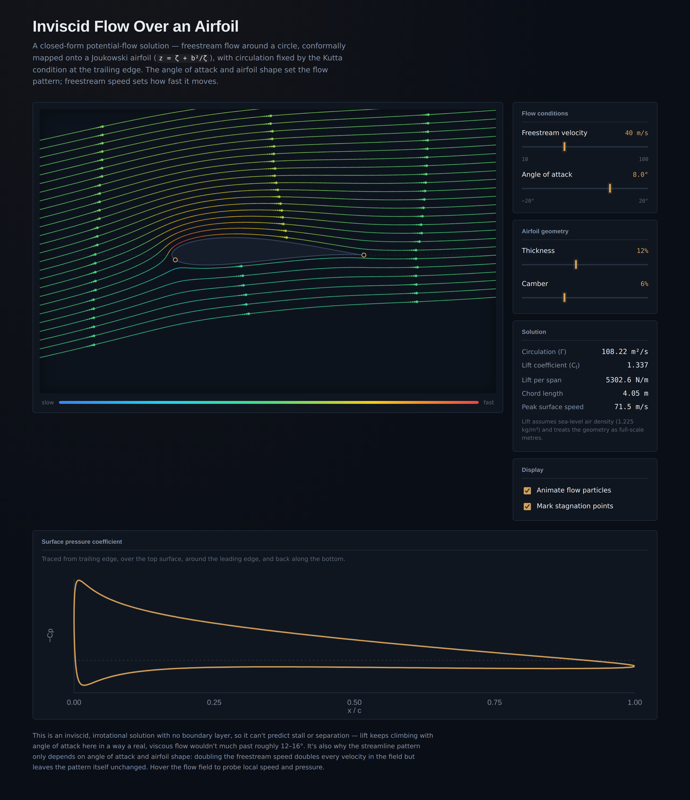

# Inviscid Flow Over an Airfoil


An interactive, single-file visualization of 2D potential flow around a Joukowski airfoil. Set the freestream velocity and angle of attack and watch the streamlines, stagnation points, and surface pressure respond in real time.



## Live demo

GitHub Pages is enabled for this repo. It is live at:

`https://<your-username>.github.io/<your-repo>/airfoil-flow-visualizer.html`

## What it shows

- Freestream flow around a circular cylinder, conformally mapped onto a Joukowski airfoil (`z = ζ + b²/ζ`)
- Circulation set automatically by the Kutta condition at the trailing edge
- Streamlines colored by local speed, plus an animated flow-particle overlay
- Front and trailing-edge stagnation points
- Surface pressure coefficient (Cp) plotted against chord position
- Live readouts: circulation Γ, lift coefficient, lift per unit span, chord length, peak surface speed
- Hover anywhere over the flow field to probe local speed and pressure at that point

## Controls

| Control | Effect |
|---|---|
| Freestream velocity | Flow speed in m/s. Changes streamline color, particle speed, and force magnitudes — the streamline *shape* depends only on angle of attack and geometry, not speed (see *How it works*). |
| Angle of attack | Tilts the freestream relative to the chord, −20° to 20°. |
| Thickness | Airfoil thickness, as a percentage of the transform's scale parameter. |
| Camber | Airfoil camber, same scale. |
| Animate flow particles | Toggles the moving-dot overlay. |
| Mark stagnation points | Toggles the two stagnation-point markers. |

## Running it

No build step, no dependencies, no server required.

1. Download `airfoil-flow-visualizer.html`
2. Open it directly in any modern browser (double-click it, or drag it into a browser window)

If you'd rather serve it over `http://` instead of `file://`:

```bash
python3 -m http.server 8000
# then visit http://localhost:8000/airfoil-flow-visualizer.html
```

## Deploying to GitHub Pages

1. Push this repo to GitHub
2. Go to **Settings → Pages**
3. Under **Build and deployment**, set **Source** to *Deploy from a branch*, branch `main`, folder `/ (root)`
4. Save — it'll publish at `https://<your-username>.github.io/<your-repo>/airfoil-flow-visualizer.html`

The included `.nojekyll` file skips GitHub's default Jekyll processing, which isn't needed for a plain static file and just slows the build. For a clean root URL with no filename, duplicate or rename `airfoil-flow-visualizer.html` to `index.html`.

## How it works

The flow is the classical potential-flow (inviscid, irrotational) solution for a cylinder in a uniform stream with circulation:

```
w(ζ) = U∞(ζ − ζ₀)e^(−iα) + U∞R²e^(iα)/(ζ − ζ₀) + i(Γ/2π)ln(ζ − ζ₀)
```

The circle is conformally mapped onto an airfoil with the Joukowski transform `z = ζ + b²/ζ`, and the circulation Γ is chosen so the trailing edge is a stagnation point — the Kutta condition — giving it a finite velocity there instead of the infinite one you'd otherwise get at a sharp corner. Lift follows from the Kutta–Joukowski theorem, `L′ = ρU∞Γ`.

Being inviscid and irrotational, this model has no boundary layer and can't predict stall or flow separation. Real airfoils depart from this picture past roughly 12–16° angle of attack — worth keeping in mind when pushing the angle-of-attack slider to its extremes.

## Tech stack

Vanilla HTML, CSS, and JavaScript — rendering is plain Canvas 2D, no charting or graphics libraries. Fonts load from Google Fonts (Space Grotesk, Inter, IBM Plex Mono); everything else is self-contained in the one HTML file.

## Browser support

Any recent evergreen browser (Chrome, Firefox, Safari, Edge). Needs JavaScript and Canvas 2D.
